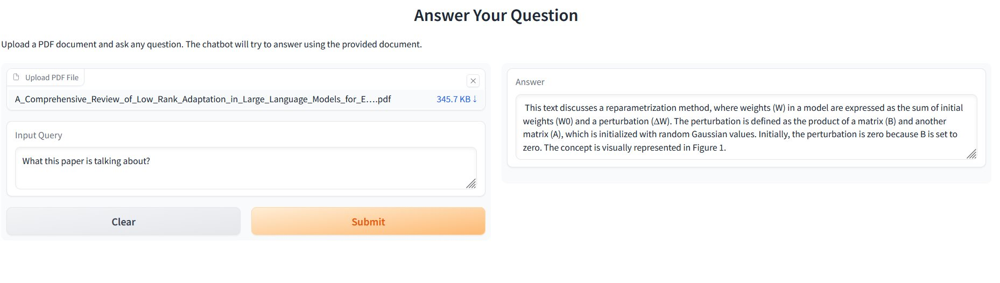

# 📄 Question-Answering Bot Using LangChain, IBM Watsonx, and Gradio

This project is a document-based QA bot web application that allows users to upload PDF documents and ask questions about their content. It uses IBM Watsonx LLM and Embeddings in a LangChain-based Retrieval-Augmented Generation (RAG) pipeline.

## 🚀 Features

- 📄 Upload and parse PDF documents
- 🤖 Ask natural language questions
- 🧠 Uses IBM Watsonx LLM (`granite-3-3-8b-instruct`)
- 🔍 Document chunking + vector search (Chroma)
- 🎯 Retrieval-based question answering (RAG)
- 🌐 Simple, clean UI with Gradio

## 🛠️ Tech Stack

- Python
- [LangChain](https://www.langchain.com/)
- [IBM Watsonx](https://www.ibm.com/products/watsonx)
- Chroma (vector DB)
- Gradio

## 📦 Setup Instructions

1. Clone the repo:
   ```bash
   git clone https://github.com/Azihadadi/RAG_PDF_QA_BOT.git
   cd qa-bot

2. Install dependencies:
   ```bash
   pip install -r requirements.txt
3. Run the app:
   ```bash
   python app/qabot.py

✅ App runs on: http://127.0.0.1:7860

📷 Screenshot



📚 Example Query

    Uploaded File: A Comprehensive Review of Low-Rank Adaptation in LLMs
    User Query: What is this paper about?
    Response: (generated summary...)

📌 Project Context

This project was completed as part of the IBM AI Engineering specialization. It demonstrates hands-on implementation of document-based QA using retrieval-augmented generation and LLMs.


## 📬 Contact

Feel free to connect if you're interested in this project or want to collaborate:

- GitHub: [Azadeh Hadadi](https://github.com/Azihadadi)
- LinkedIn: _[َAzadeh Hadadi](https://www.linkedin.com/in/azadeh-hadadi/)_  


   

